# Getting Started Overview

## 🚀 **Welcome to EPIC Integration**

This comprehensive guide will take you from zero to a fully functional payment integration with DBKL's EPIC payment gateway in just a few steps.

## 📋 **Integration Checklist**

Before you begin, ensure you have:

- [ ] Active DBKL merchant account
- [ ] Development environment setup
- [ ] Basic understanding of web development
- [ ] HTTPS-enabled website (required for production)
- [ ] Access to server logs for debugging

## 🛣️ **Integration Journey**

```mermaid
graph LR
    A[📋 Requirements] --> B[🔧 Sandbox Setup]
    B --> C[💻 First Integration]
    C --> D[🧪 Testing]
    D --> E[🚀 Go Live]
    
    style A fill:#e1f5fe
    style B fill:#f3e5f5
    style C fill:#e8f5e8
    style D fill:#fff3e0
    style E fill:#ffebee
```

## ⏱️ **Time Estimates**

| Phase | Developer Experience | Time Required |
|-------|---------------------|---------------|
| **Setup & Onboarding** | Beginner | 2-4 hours |
|  | Intermediate | 1-2 hours |
|  | Advanced | 30-60 minutes |
| **First Integration** | Beginner | 4-8 hours |
|  | Intermediate | 2-4 hours |
|  | Advanced | 1-2 hours |
| **Testing & Debugging** | All levels | 2-4 hours |
| **Production Deployment** | All levels | 1-2 hours |

## 🎯 **What You'll Build**

By the end of this guide, you'll have:

### **For Developers** 👨‍💻
- Complete payment integration
- Secure checksum handling
- Error handling and logging
- Transaction status checking
- Response callback processing

### **For Business Teams** 💼
- Understanding of the integration process
- Knowledge of testing procedures
- Production deployment checklist
- Monitoring and support procedures

## 🔧 **Technical Prerequisites**

### **Development Environment**
- **Web Server**: Apache/Nginx with PHP 7.4+ or equivalent
- **SSL Certificate**: Required for production (Let's Encrypt recommended)
- **Database**: MySQL/PostgreSQL for transaction logging
- **Version Control**: Git for code management

### **Programming Languages Supported**
- **PHP** (Recommended) - Complete library provided
- **ASP.NET** - Library and examples available
- **Java** - SDK and documentation provided
- **Ruby** - Community-maintained gem
- **Node.js** - Community examples available

### **Security Requirements**
- HTTPS-enabled website
- Secure credential storage
- Input validation and sanitization
- Transaction logging capabilities

## 🏗️ **Architecture Overview**

### **Simple Integration Flow**

### **Key Components**

1. **Payment Form**: Collects payment details from customer
2. **Request Handler**: Processes and sends payment to EPIC
3. **Callback Handler**: Receives and processes payment results
4. **Status Checker**: Queries transaction status
5. **Error Handler**: Manages failures and retries

## 📚 **Documentation Structure**

Our documentation is organized into three main sections:

### **🔧 For Developers**
- **[Getting Started](./overview)** - This overview and setup guide
- **[Integration Guide](../integration/architecture)** - Advanced technical details
- **[Code Examples](../examples/php)** - Ready-to-use code samples

### **📊 For Project Managers**
- **[Business Overview](../business/overview)** - Executive summary and benefits
- **[Project Planning](../business/overview)** - Project timeline and requirements

### **🔗 API Reference**
- **[API Overview](../api/overview)** - Complete API documentation

## 🎓 **Learning Path**

### **Beginner Path** (New to Payment Gateways)
1. Start with [Business Overview](../business/overview) to understand the big picture
2. Work through this Getting Started guide carefully
3. Follow the [PHP Integration Example](../examples/php)
4. Review [API Documentation](../api/overview) for details

### **Intermediate Path** (Some Payment Gateway Experience)
1. Quick review of [API Overview](../api/overview)
2. Implement using [Code Examples](../examples/php)
3. Focus on [Integration Architecture](../integration/architecture)

### **Advanced Path** (Experienced Developers)
1. Review [Integration Architecture](../integration/architecture)
2. Download libraries and implement directly
3. Focus on optimization and advanced features

## 🛡️ **Security First Approach**

Security is paramount in payment processing. Our integration ensures:

### **Data Protection**
- End-to-end encryption using AES-256
- Secure checksum validation
- PCI DSS compliance guidelines
- No sensitive data storage requirements

### **Authentication**
- Multi-factor authentication with API keys and passphrases
- Request signature validation
- Rate limiting and abuse prevention
- IP whitelisting options

### **Monitoring**
- Real-time transaction monitoring
- Fraud detection capabilities
- Comprehensive audit logging
- Automated alert systems

## 🤝 **Support & Resources**

### **Getting Help**
- **Technical Support**: [tech.support@dbkl.gov.my](mailto:tech.support@dbkl.gov.my)
- **Business Inquiries**: [business@dbkl.gov.my](mailto:business@dbkl.gov.my)
- **Documentation Issues**: [docs@dbkl.gov.my](mailto:docs@dbkl.gov.my)

### **Response Times**
- **Critical Issues**: 2 hours (business hours)
- **General Support**: 4 hours (business hours)
- **Documentation Updates**: 24 hours

### **Business Hours**
- **Malaysia Time**: Monday - Friday, 9:00 AM - 6:00 PM
- **Emergency Support**: Available for production issues

## 📈 **Success Metrics**

Track your integration success with these key metrics:

### **Technical Metrics**
- **Integration Time**: How quickly you complete setup
- **Error Rate**: Percentage of failed transactions
- **Response Time**: Average API response times
- **Uptime**: System availability percentage

### **Business Metrics**
- **Conversion Rate**: Percentage of completed payments
- **User Experience**: Customer satisfaction scores
- **Cost Efficiency**: Transaction processing costs
- **Revenue Impact**: Increase in successful payments

## 🎯 **Next Steps**

Ready to begin your EPIC integration journey?

### **Choose Your Path:**

**🚀 Quick Start**
Jump right into coding
**→ [PHP Integration Example](../examples/php)**

**📋 Methodical Approach**
Understand the architecture first
**→ [Integration Architecture](../integration/architecture)**

**💼 Business Overview**
Understand the business case
**→ [Business Guide](../business/overview)**

---

:::tip Pro Tip
Start with the sandbox environment to familiarize yourself with the API before moving to production. This will save you time and prevent issues later.
:::

:::info Support Available
Our technical team is here to help throughout your integration process. Don't hesitate to reach out if you need assistance at any stage.
::: 
