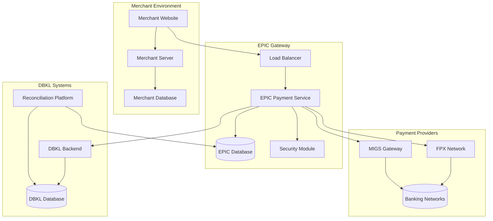
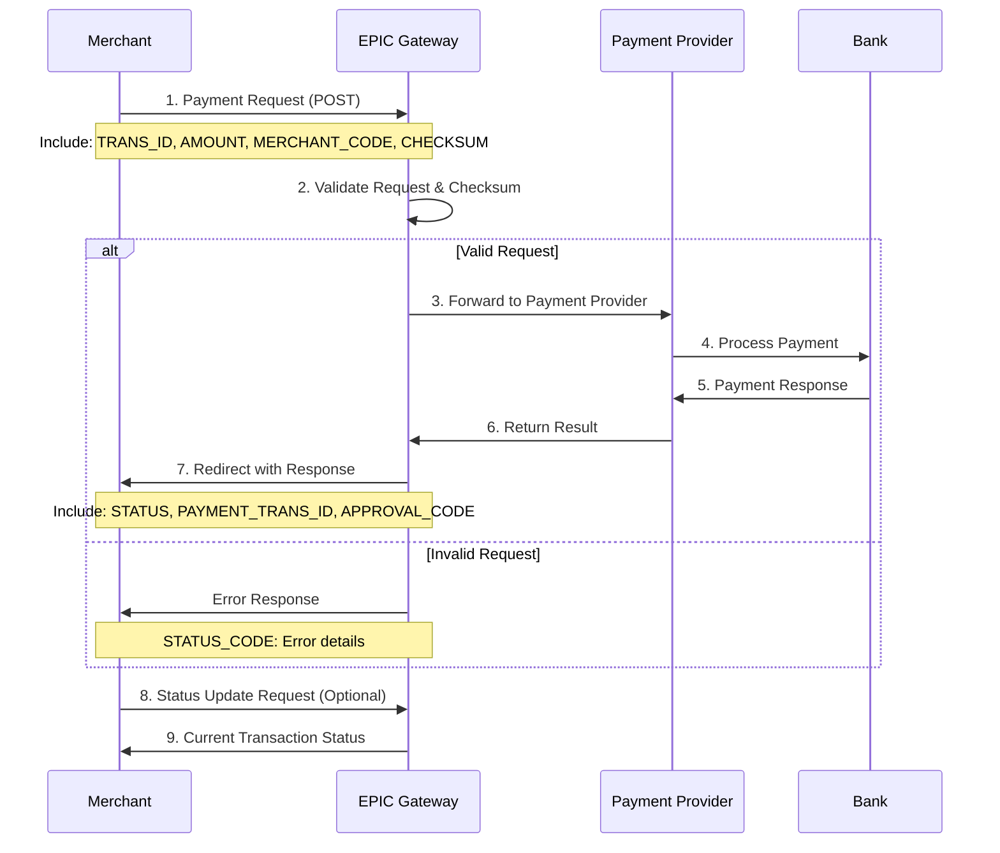
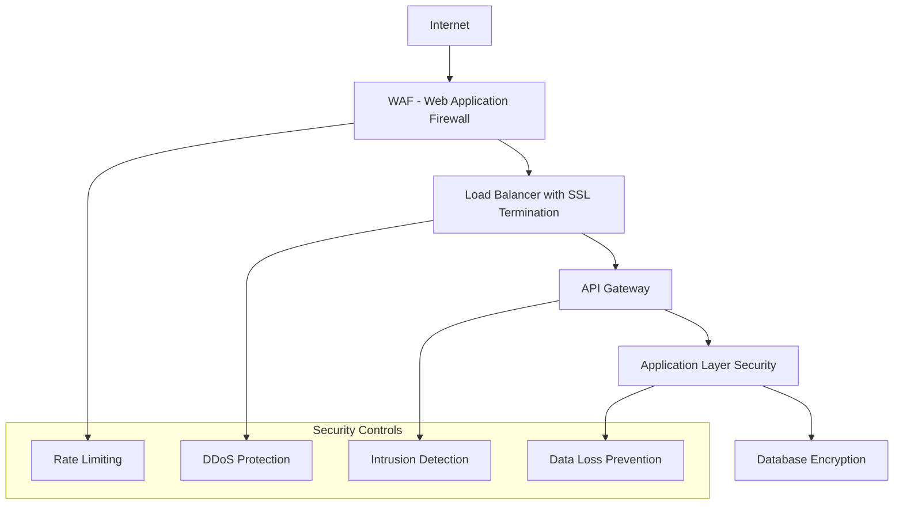
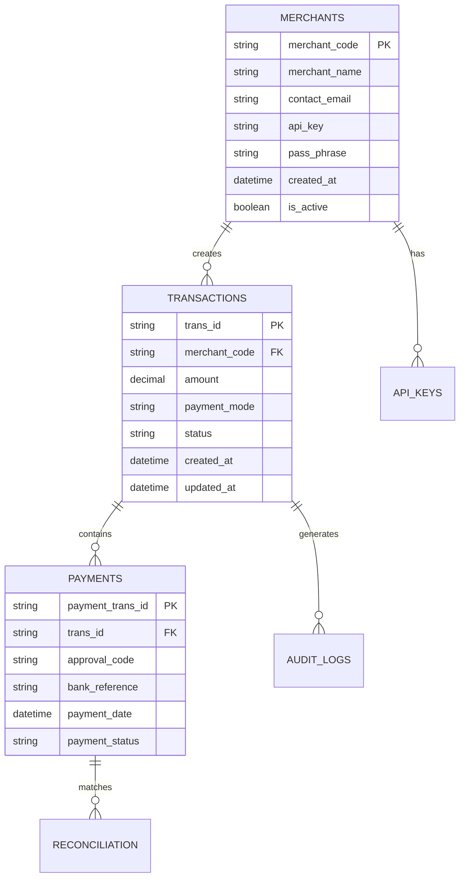

# Integration Architecture

## 🏗️ **System Architecture Overview**

The EPIC payment gateway follows a secure, multi-layered architecture designed for high availability, security, and scalability.



## 🔄 **Payment Flow Sequence**

### **Standard Payment Flow**



## 🛠️ **Integration Components**

### **1. Request Handler**
- **Purpose**: Process incoming payment requests
- **Technology**: RESTful API endpoints
- **Security**: Checksum validation, rate limiting
- **Scalability**: Horizontal scaling with load balancing

### **2. Security Module**
- **Encryption**: AES-256 encryption for sensitive data
- **Authentication**: Merchant key validation
- **Integrity**: SHA-256 checksum verification
- **Audit**: Complete transaction logging

### **3. Payment Router**
- **FPX Integration**: Direct connection to PayNet
- **MIGS Integration**: Mastercard Internet Gateway Service
- **Bank List Management**: Dynamic bank list updates
- **Failover**: Automatic provider switching

### **4. Response Handler**
- **Real-time Updates**: Instant status notifications
- **Webhook Support**: Asynchronous notifications
- **Error Handling**: Graceful degradation
- **Retry Logic**: Exponential backoff for failures

## 🔐 **Security Architecture**

### **Multi-Layer Security**



### **Security Features**
- **SSL/TLS 1.3**: End-to-end encryption
- **PCI DSS Compliance**: Credit card data protection
- **Tokenization**: Sensitive data replacement
- **Fraud Detection**: Real-time transaction monitoring
- **Access Control**: Role-based permissions

## 🔗 **API Endpoints Architecture**

### **Primary Endpoints**

| Endpoint | Method | Purpose | Rate Limit |
|----------|--------|---------|------------|
| `/eps/request` | POST | Initiate payment | 100/min |
| `/eps/update` | POST | Status updates | 200/min |
| `/eps/callback` | POST | Async notifications | Unlimited |
| `/eps/reconcile` | GET | Transaction reconciliation | 10/min |

### **Request/Response Flow**

```php
// Request Structure
POST https://epaymentstg.dbkl.gov.my/eps/request
Content-Type: application/x-www-form-urlencoded

TRANS_ID=TXN20240101001
AMOUNT=100.50
MERCHANT_CODE=DBKL001
PAYMENT_MODE=fpx
CHECKSUM=encrypted_validation_string
// ... additional DBKL-specific fields
```

```json
// Response Structure
{
    "STATUS": "SUCCESS",
    "STATUS_CODE": "00",
    "STATUS_MESSAGE": "Transaction Successful",
    "PAYMENT_TRANS_ID": "EPG20240101001",
    "APPROVAL_CODE": "123456",
    "TRANS_ID": "TXN20240101001",
    "AMOUNT": "100.50",
    "CHECKSUM": "response_validation_string"
}
```

## 📊 **Data Architecture**

### **Database Schema Overview**



### **Data Flow**
1. **Transaction Creation**: Merchant initiates payment
2. **Validation**: System validates request integrity
3. **Processing**: Payment routed to appropriate provider
4. **Response**: Real-time status update
5. **Reconciliation**: Daily matching with bank records
6. **Reporting**: Business intelligence and analytics

## 🚀 **Performance & Scalability**

### **Performance Targets**
- **Response Time**: < 2 seconds for payment initiation
- **Throughput**: 10,000 transactions per minute
- **Availability**: 99.9% uptime (8.76 hours downtime/year)
- **Scalability**: Horizontal scaling to handle peak loads

### **Caching Strategy**
- **Redis**: Session and temporary data
- **CDN**: Static assets and documentation
- **Database**: Query result caching
- **API**: Response caching for stable data

## 🔄 **Integration Patterns**

### **Synchronous Integration**
```php
// Direct API call for immediate response
$response = $epic->processPayment([
    'trans_id' => 'TXN001',
    'amount' => 100.50,
    'payment_mode' => 'fpx'
]);

if ($response['status'] === 'SUCCESS') {
    // Handle successful payment
    redirectToSuccessPage($response);
} else {
    // Handle payment failure
    showErrorMessage($response['status_message']);
}
```

### **Asynchronous Integration**
```php
// Webhook handler for status updates
public function handleWebhook(Request $request) {
    $payload = $request->all();
    
    // Verify webhook signature
    if (!$this->verifySignature($payload)) {
        return response('Unauthorized', 401);
    }
    
    // Process status update
    $this->updateTransactionStatus($payload);
    
    return response('OK', 200);
}
```

## 📈 **Monitoring & Analytics**

### **Key Metrics**
- **Transaction Volume**: Real-time and historical
- **Success Rates**: By payment method and time
- **Error Rates**: Detailed error categorization
- **Performance**: Response times and throughput
- **Security**: Failed authentication attempts

### **Alerting System**
- **Critical**: System downtime, security breaches
- **Warning**: High error rates, performance degradation
- **Info**: Unusual transaction patterns, maintenance windows

---

:::tip Next Steps
Now that you understand the architecture, you can proceed to implement your integration using our [PHP Code Examples](../examples/php) or explore the [API Reference](../api/overview) for detailed technical specifications.
:::
