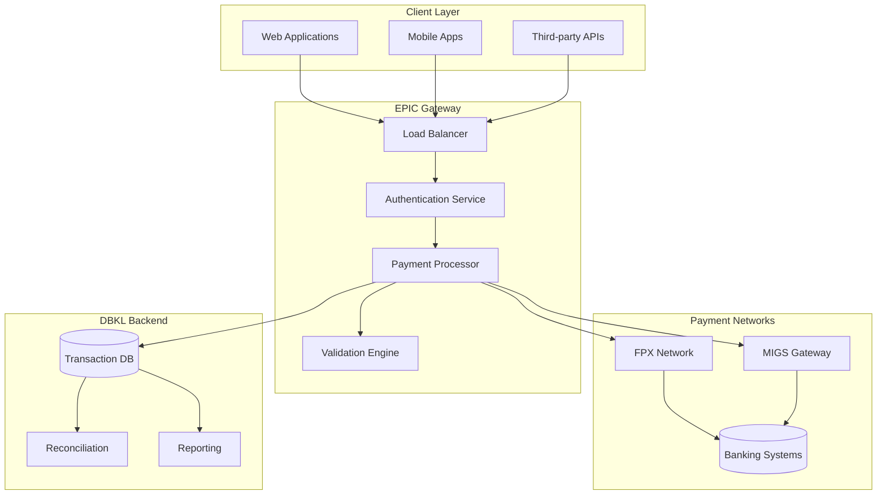
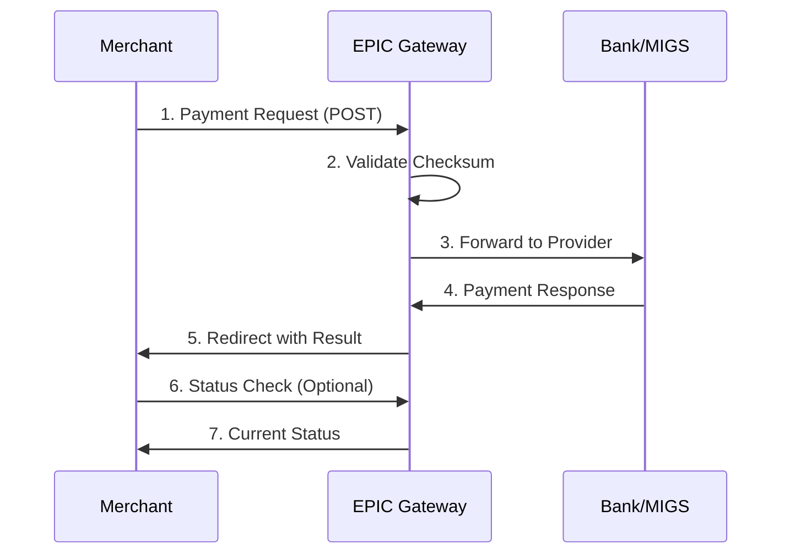

# EPIC Payment Gateway - System Design Document

## System Overview

**EPIC (Electronic Payment Integrated Console)** is DBKL's enterprise payment gateway system that provides secure, real-time payment processing capabilities through multiple channels.

## 🏗️ Architecture Components



## Payment Processing Methods

### 1. FPX Integration (Online Banking)
- **Endpoint**: `/eps/request`
- **Method**: POST
- **Response Time**: 2-5 seconds
- **Banks Supported**: All Malaysian banks

### 2. MIGS Integration (Credit Cards)
- **Endpoint**: `/eps/request`
- **Method**: POST  
- **Response Time**: 3-8 seconds
- **Cards Supported**: Visa, Mastercard, Amex

## API Endpoints

| Endpoint | Method | Purpose | Rate Limit |
|----------|--------|---------|------------|
| `/eps/request` | POST | Process payment | 100/min |
| `/eps/update` | POST | Status check | 200/min |
| `/eps/callback` | POST | Payment notifications | Unlimited |
| `/eps/reconcile` | GET | Transaction reconciliation | 10/hour |

## Request Structure

```php
POST /eps/request
Content-Type: application/x-www-form-urlencoded

TRANS_ID=TXN20240101001
AMOUNT=100.50
MERCHANT_CODE=DBKL001
PAYMENT_MODE=fpx
CHECKSUM=encrypted_validation_string
RESPONSE_URL=https://yoursite.com/callback
KOD_HASIL=KH001
PROCESS_CODE=PC001
MODULE_ID=MD001
```

## Response Structure

```json
{
    "STATUS": "SUCCESS",
    "STATUS_CODE": "00", 
    "STATUS_MESSAGE": "Transaction Successful",
    "PAYMENT_TRANS_ID": "EPG20240101001",
    "APPROVAL_CODE": "123456",
    "TRANS_ID": "TXN20240101001",
    "AMOUNT": "100.50",
    "CHECKSUM": "response_validation_string"
}
```

## Security Implementation

### Checksum Generation
```php
$checksumData = $transId . $paymentMode . $amount . $merchantCode;
$checksum = encrypt($checksumData, $apiKey, $passPhrase);
```

### SSL/TLS Requirements
- **Minimum**: TLS 1.2
- **Recommended**: TLS 1.3
- **Certificate**: 256-bit encryption

## Environment URLs

### Staging
```
Request: https://epaymentstg.dbkl.gov.my/eps/request
Update:  https://epaymentstg.dbkl.gov.my/eps/update
```

### Production
```
Request: https://epayment.dbkl.gov.my/eps/request
Update:  https://epayment.dbkl.gov.my/eps/update
```

## Implementation Flow



## Error Codes

| Code | Description | Action Required |
|------|-------------|----------------|
| `00` | Success | Complete transaction |
| `01` | Declined by bank | Retry with different method |
| `05` | Insufficient funds | Notify customer |
| `12` | Invalid transaction | Check parameters |
| `30` | Format error | Validate request format |
| `96` | System error | Retry later |

## Required Parameters

### Mandatory Fields
- `TRANS_ID` - Unique transaction identifier
- `AMOUNT` - Payment amount (decimal format)
- `MERCHANT_CODE` - DBKL assigned merchant code
- `PAYMENT_MODE` - fpx/migs
- `CHECKSUM` - Encrypted validation string

### DBKL Specific Fields
- `KOD_HASIL` - Revenue code
- `PROCESS_CODE` - Process identifier  
- `MODULE_ID` - Module identifier
- `EMAIL` - Customer email (optional)
- `CUST_NAME` - Customer name (optional)

## Performance Specifications

| Metric | Target | Monitoring |
|--------|--------|------------|
| **Response Time** | < 2 seconds | Real-time |
| **Availability** | 99.9% | 24/7 |
| **Throughput** | 10K TPS | Peak load |
| **Error Rate** | < 0.1% | Continuous |

## Integration Examples

### PHP Implementation
```php
$epic = new EpicPayment();
$request = $epic->createPaymentRequest([
    'trans_id' => 'TXN' . time(),
    'amount' => 100.50,
    'payment_mode' => 'fpx',
    'response_url' => 'https://site.com/callback'
]);
```

### Status Check
```php
$status = $epic->checkTransactionStatus('TXN20240101001');
if ($status['is_successful']) {
    // Handle success
}
```

## Technical Support

- **Email**: tech.support@dbkl.gov.my
- **Response**: 4 hours (business hours)
- **Hours**: Mon-Fri, 9AM-6PM (Malaysia Time)
- **Status**: [status.epayment.dbkl.gov.my](https://status.epayment.dbkl.gov.my)

---

## Quick Navigation

- **[System Architecture Details](integration/architecture)** - Complete technical architecture
- **[PHP Integration Guide](examples/php)** - Production-ready code examples  
- **[API Reference](api/overview)** - Complete API documentation
- **[Business Requirements](business/overview)** - System requirements and specifications
