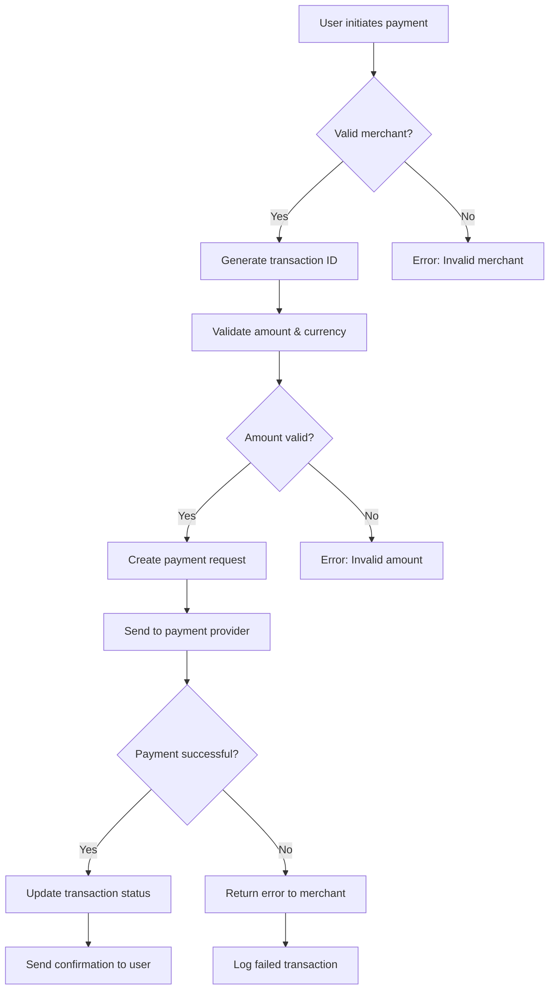
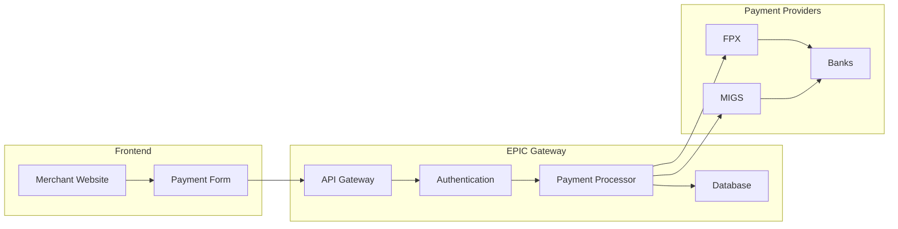
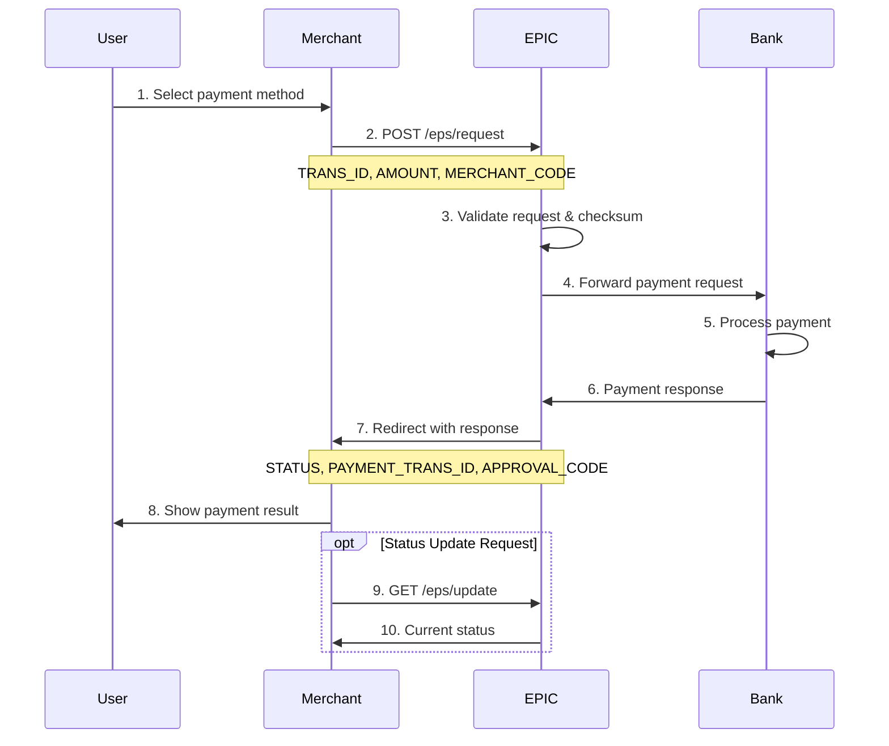
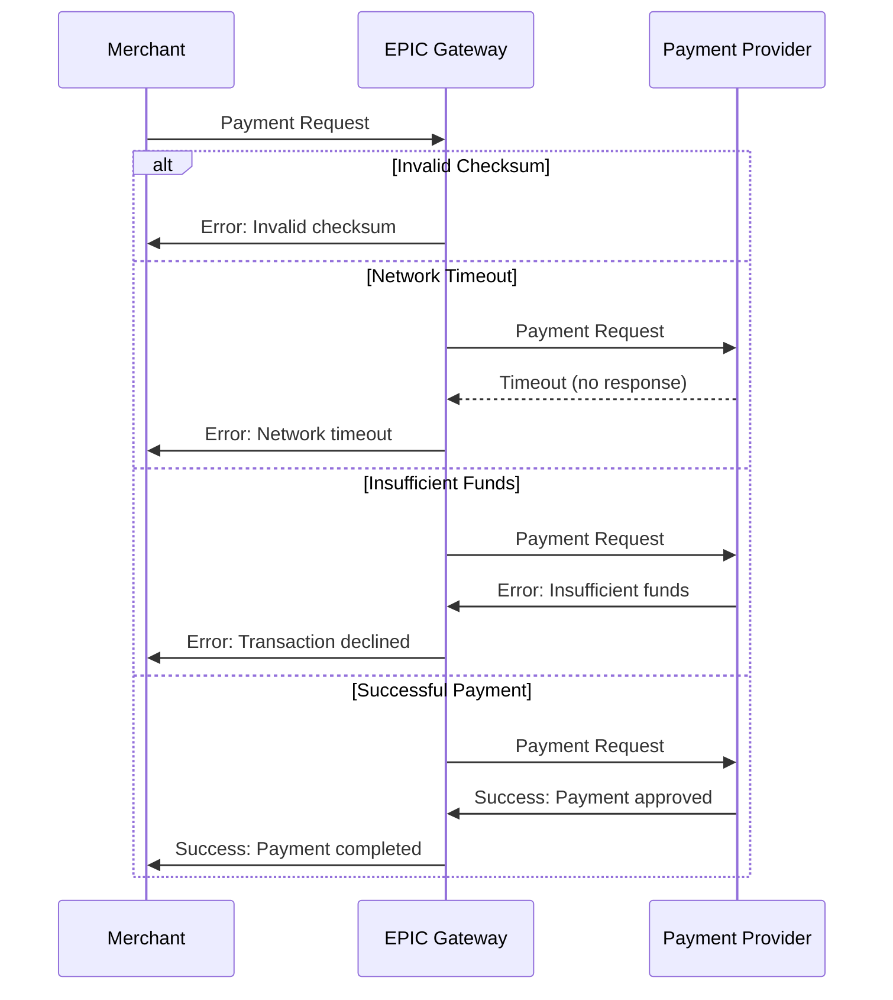
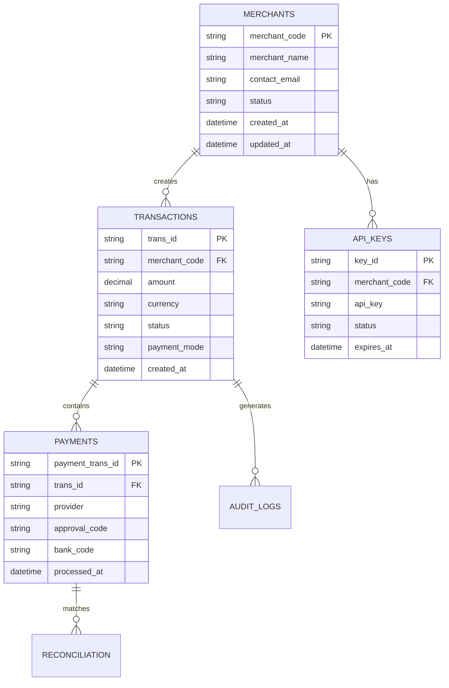
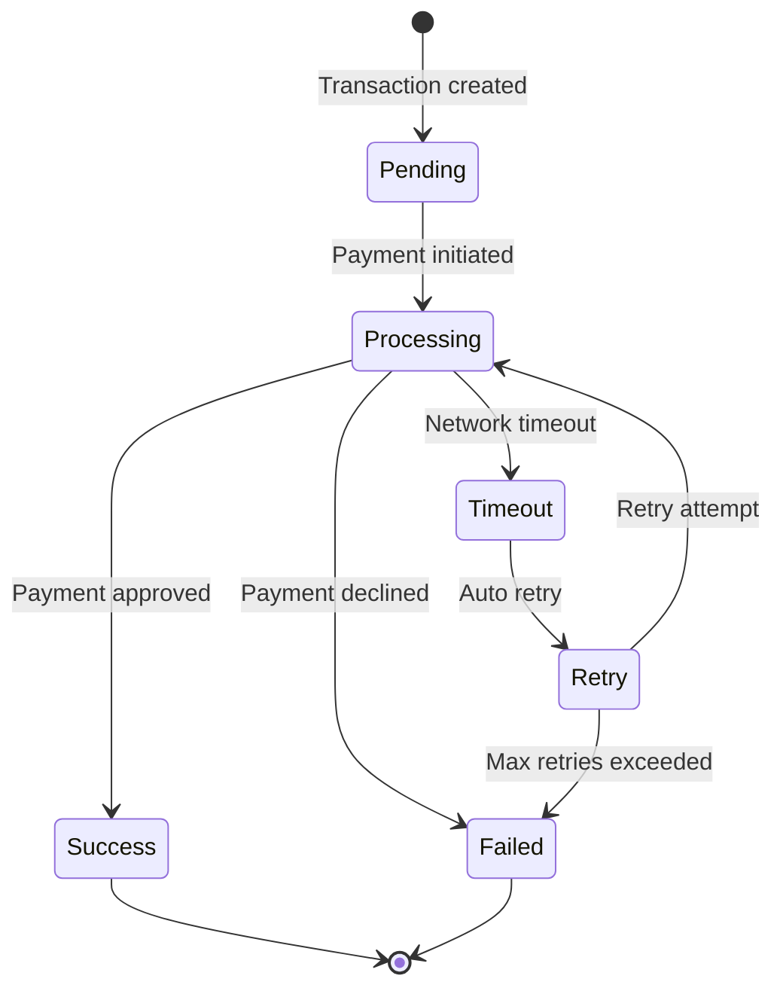
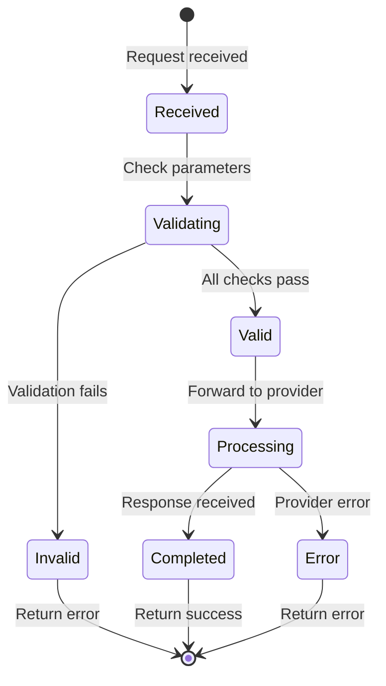
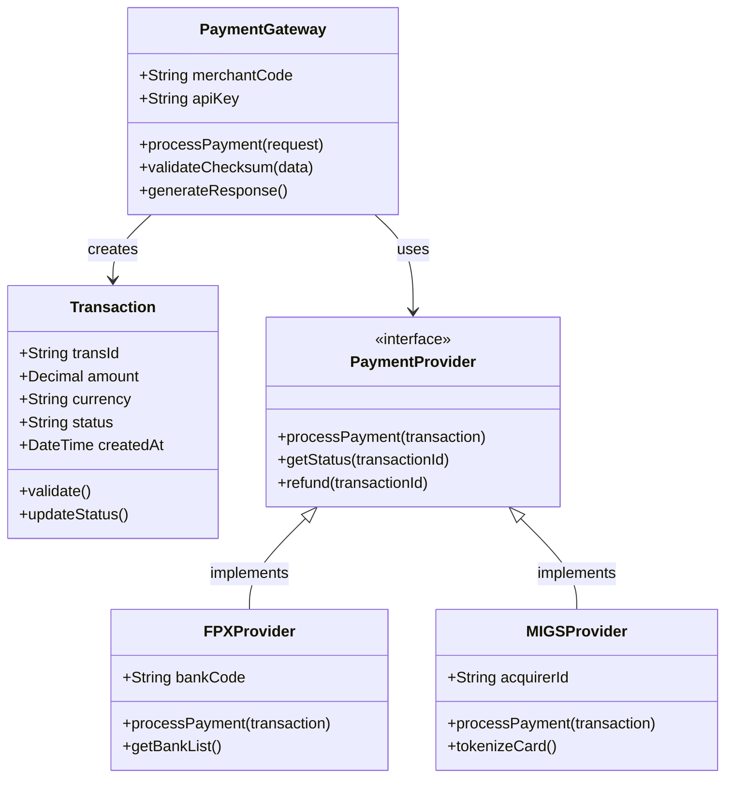
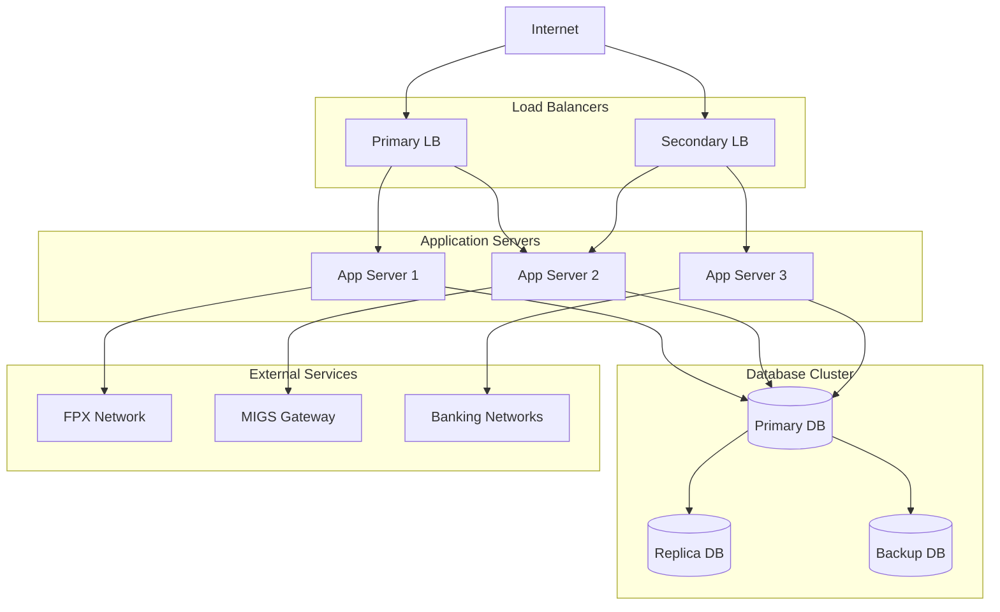
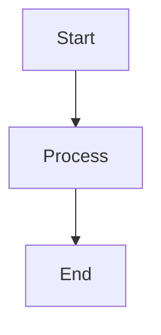

# Mermaid Diagram Examples

This page demonstrates the various types of Mermaid diagrams you can create directly in markdown without needing external images.

## 🔄 Flow Charts

### Payment Processing Flow



### System Architecture Flow



## 📊 Sequence Diagrams

### Complete Payment Sequence



### Error Handling Sequence



## 🗂️ Entity Relationship Diagrams

### Database Schema



## 📈 State Diagrams

### Transaction Status Flow



### API Request States



## 🏗️ Class Diagrams

### Payment Gateway Classes



## 🌐 Network Diagrams

### System Infrastructure



## How to Use Mermaid in Your Docs

Simply use the `mermaid` code block in your markdown files:

````markdown

````

### Supported Diagram Types:
- **Flowcharts** (`graph` or `flowchart`)
- **Sequence Diagrams** (`sequenceDiagram`)
- **Class Diagrams** (`classDiagram`)
- **State Diagrams** (`stateDiagram-v2`)
- **Entity Relationship** (`erDiagram`)
- **User Journey** (`journey`)
- **Gantt Charts** (`gantt`)
- **Pie Charts** (`pie`)
- **Git Flow** (`gitgraph`)

No more need for external image files - create professional diagrams directly in your markdown! 
